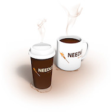

# Documentation

**needle4k is a lightweight framework for testing
([Java EE/Jakarta EE](https://jakarta.ee/), [Spring Bean](https://spring.io/), e.g.) components in isolation.
Using needle4k it is easy to configure your tests in order to automatically inject mock and real objects into tested components.
needle4k is a [Kotlin-based](https://kotlinlang.org/) rewrite and upgraded version of the reliable
[needle4k](https://needle4j.org/) framework.**

# Content

<!-- TOC -->
* [Configuration](configuration.md)
* [Database testing](database-testing.md)
<!-- TOC -->